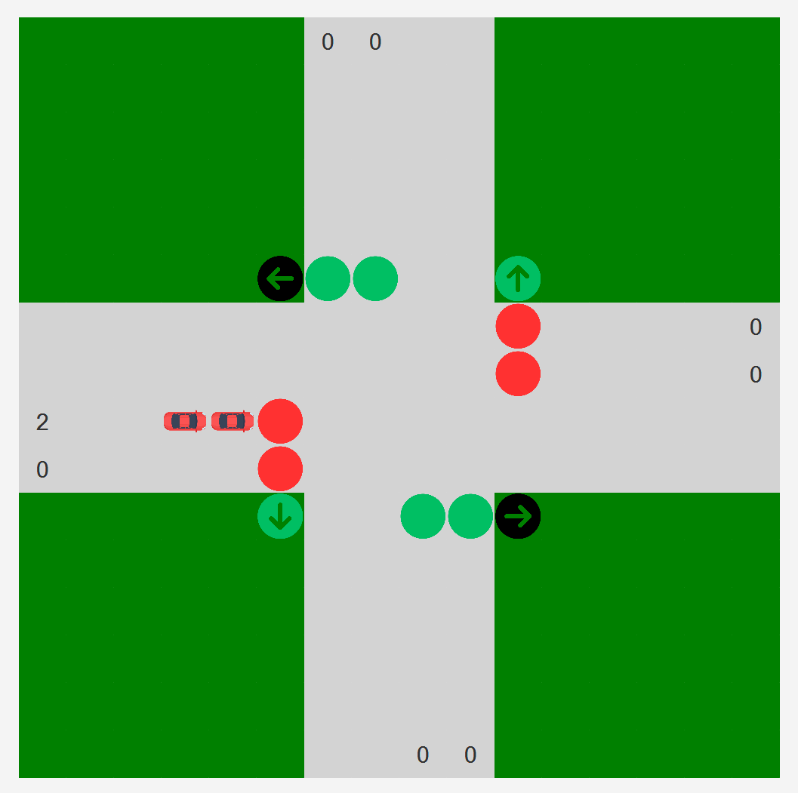

# Intersection Simulation
This project creates a simple intersection simulation in Java. It reads input from a **JSON file**, which contains commands to **add vehicles** or **make a simulation step**. After each **step**, vehicles that have left the intersection are **written to an output JSON file**.

## Specifications
- **Traffic Lights** – There are four possible light states: **RED, GREEN, ORANGE, and REDTOGREEN**, which change in a cycle. Additionally, there is a **right arrow signal** for the rightmost lane.
- **Roads** – There are four roads: **NORTHERN, SOUTHERN, WESTERN, and EASTERN**. All lanes on a given road share the same traffic light color at any moment.
- **Lanes** – Each road has the same number of lanes. Vehicles can turn **left only from the leftmost lane**, while vehicles in other lanes can go **straight or turn right**.
- **Left Turns** – If a vehicle turning left encounters a collision, it can **wait in the middle of the intersection** and exit once the orange light appears or there is no more a collision.
- **Right Arrow** – If a vehicle is turning **right on a green arrow**, it must **check for potential collisions** before proceeding.
## Algorithm
1. Initially, the **northern and southern roads** have a **green light**, while the **eastern and western roads** have a **red light**. This state is called **GreenRedLightState**.
2. After the **GreenRedLightState**, the **OrangeState** occurs:
    - All roads receive an **orange light**, but with a distinction:
        - One pair of opposite roads has a **normal orange light**.
        - The other pair has a **RedToGreen transition**.
    - The **only vehicles allowed to move** during this state are those **waiting in the middle of the intersection**.
3. After the **OrangeState**, the cycle returns to the **previous GreenRedLightState**.
4. If there are **no vehicles waiting** on roads that currently have a red light, the **traffic lights do not change**, improving traffic flow by avoiding unnecessary state transitions.

## GUI
A simple **JavaFX-based visualization** displays the **number of vehicles waiting in each lane**, helping users better understand the traffic flow at the intersection.

